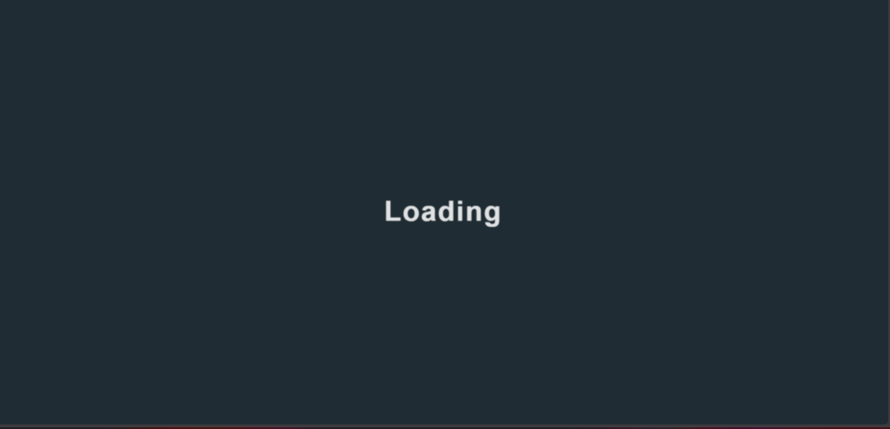
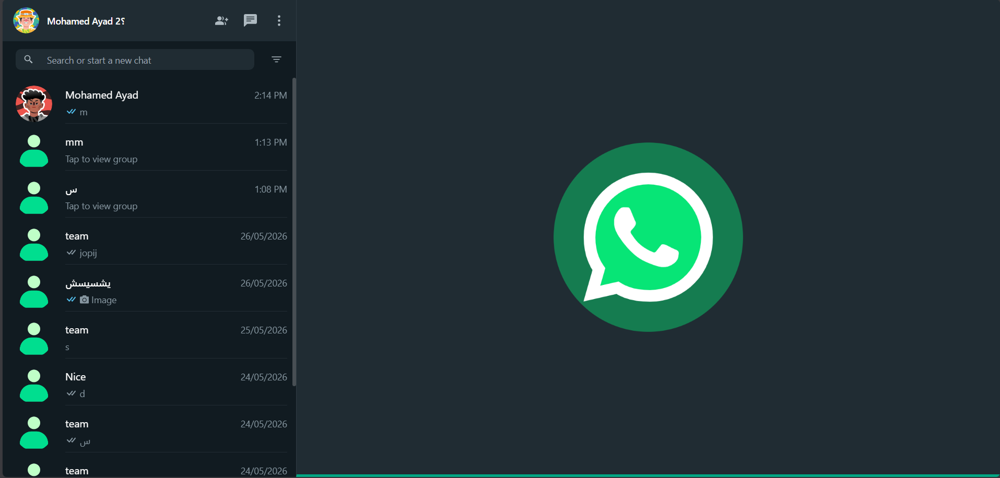
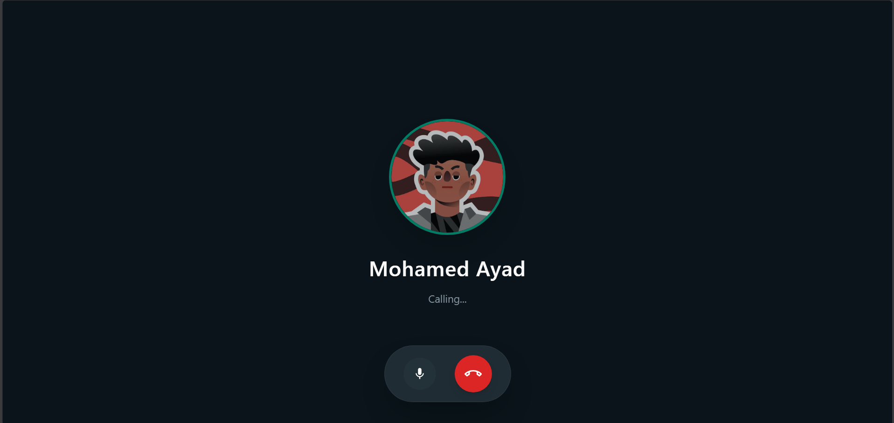

<div align="center">

# 💬 WhatsApp Clone — Frontend

A full-featured, real-time chat application built with Next.js 13 — including voice messages, peer-to-peer video/audio calls built from scratch using the native WebRTC API, message encryption, and offline storage.

[](https://nextjs.org/)
[](https://react.dev/)
[](https://tailwindcss.com/)
[](https://socket.io/)
[](https://firebase.google.com/)
[](https://webrtc.org/)

**[🌐 Live Demo](https://whatsapp-client-delta.vercel.app)** · **[🖥️ Backend Repo](https://github.com/mohamed-ayad40/Whatsapp-server1)**

</div>

---

## 📸 Screenshots

| Home | Chat | Voice Call |
|:---:|:---:|:---:|
|  |  |  |

---

## ✨ Features

- **Real-Time Messaging** — Instant delivery via Socket.io with online presence indicators and read receipts
- **P2P Video & Audio Calls** — Built from scratch using the native browser **WebRTC API** (`RTCPeerConnection`) with no third-party SDK — supports mute, camera toggle, and a live call timer
- **ICE Candidate Queuing** — Custom synchronization logic to buffer ICE candidates until the remote description is ready, ensuring reliable call setup across different network conditions
- **Voice Messages** — Record and send audio messages directly in the browser via Mic Recorder, with waveform playback powered by WaveSurfer.js
- **Firebase Authentication** — Phone number and Google sign-in
- **Message Encryption** — Client-side encryption using CryptoJS before data is sent
- **Offline Storage** — IndexedDB caching via Dexie.js for a seamless offline-first experience
- **Emoji Picker** — Full emoji support integrated into the chat input
- **Virtualized Chat Lists** — High-performance rendering of long message threads with react-virtuoso
- **Image Sharing** — Send and preview images with automatic client-side resizing before upload
- **Responsive UI** — Clean, mobile-first design styled with Tailwind CSS

---

## 🛠️ Tech Stack

| Layer | Technology |
|---|---|
| Framework | Next.js 13 (Pages Router) |
| UI | React 18 + Tailwind CSS |
| Real-Time | Socket.io Client |
| Video/Audio Calls | Native WebRTC API (`RTCPeerConnection`) |
| Auth | Firebase 9 |
| Encryption | CryptoJS |
| Offline Storage | Dexie.js (IndexedDB) |
| Audio | Mic Recorder to MP3, WaveSurfer.js |
| HTTP Client | Axios |
| Icons | React Icons |

---

## 📁 Project Structure

```
├── public/          # Static assets
├── src/
│   ├── components/  # Reusable UI components
│   ├── pages/       # Next.js route pages
│   ├── context/     # Global state (StateContext + reducers)
│   ├── hooks/       # Custom React hooks
│   └── utils/       # Helper functions
├── tailwind.config.js
└── next.config.js
```

---

## 🚀 Getting Started

### Prerequisites

- Node.js ≥ 18
- A running instance of the [backend server](https://github.com/mohamed-ayad40/Whatsapp-server1)
- Firebase project credentials

### Installation

```bash
# 1. Clone the repository
git clone https://github.com/mohamed-ayad40/Whatsapp-client.git
cd Whatsapp-client

# 2. Install dependencies
npm install

# 3. Configure environment variables
cp .env.example .env.local
# Add NEXT_PUBLIC_SERVER_URL and your Firebase config

# 4. Run the development server
npm run dev
```

Open [http://localhost:3000](http://localhost:3000) in your browser.

---

## 📞 WebRTC Architecture

Calls are fully peer-to-peer — the backend only acts as a **signaling server** to exchange connection metadata. Once the call is established, all audio/video data flows directly between peers with zero server involvement.

```
Caller                  Server (Socket.io)              Receiver
  |                           |                             |
  |-- accept-incoming-call -->|                             |
  |                           |<-- accept-call ------------|
  |-- webrtc-offer ---------->|-- webrtc-offer-received -->|
  |                           |<-- webrtc-answer -----------|
  |<-- webrtc-answer-received-|                             |
  |<======= ICE candidates exchanged ===================>  |
  |<=============== P2P media stream active =============>  |
```

> **Note:** For real-time features (messaging and calls) to work in production, the backend must be hosted on a platform that supports persistent WebSocket connections (e.g., Railway, Render, or a VPS). The current live demo runs on Vercel which has WebSocket limitations.

---

## 📄 License

MIT © [Mohamed Ayad](https://github.com/mohamed-ayad40)
